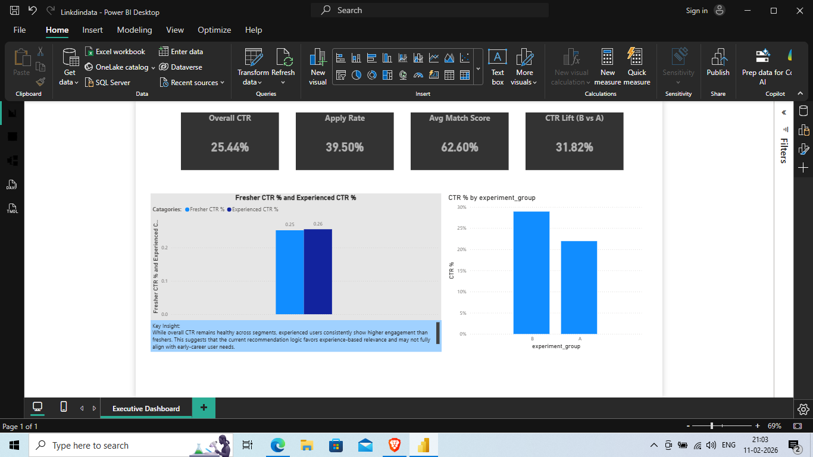

# AI Job Recommendation -- Segmented Ranking Analysis

## Overview

This project analyses an AI-driven job recommendation system to evaluate
engagement performance across career segments.

The analysis identifies an engagement gap between early-career users
(freshers) and experienced professionals and evaluates ranking
performance using A/B experimentation.

------------------------------------------------------------------------

## Problem

While overall Click-Through Rate (CTR) appeared healthy at an aggregate
level, segmentation revealed that freshers consistently underperformed
compared to experienced users.

The objective was to determine whether the engagement gap stemmed
from: - User intent differences - Ranking bias - Feature-weight
imbalance within the recommendation model

------------------------------------------------------------------------

## Metrics Analysed

Primary Metric: - Click-Through Rate (CTR)

Secondary Metrics: - Apply Rate - Average Match Score

Experimental Metric: - CTR Lift (Variant B vs Control A)

Guardrails: - No degradation in experienced-user performance - Stable
downstream application volume

------------------------------------------------------------------------

## Validation Strategy

A controlled A/B experiment was conducted:

Control (A): Existing ranking logic

Variant (B): Adjusted recommendation logic

Evaluation focused on: - Relative CTR uplift - Impact on Apply Rate -
Segment-specific engagement changes

------------------------------------------------------------------------

## Key Findings

-   Overall CTR ≈ 25%
-   Freshers underperform relative to experienced users
-   Variant B improves aggregate CTR
-   Engagement gap persists across segments

------------------------------------------------------------------------

## Decision Recommendation

Introduce segment-aware ranking optimisation to improve early-career
engagement without degrading experienced-user performance.

The rollout decision should depend on: - Statistically meaningful CTR
lift - Stable Apply Rate - Measurable reduction in segment engagement
gap

------------------------------------------------------------------------

## Tools Used

-   Power BI
-   DAX
-   A/B Testing Analysis
-   Funnel Segmentation

------------------------------------------------------------------------

## Dashboard Preview

(Add dashboard screenshot inside the repository under a /screenshots
folder and reference it here.)

Example:

!

------------------------------------------------------------------------

## Why This Project Matters

This case demonstrates: - Segmentation-driven analysis beyond aggregate
metrics - Funnel-based behavioral reasoning - Controlled experimentation
under business constraints - Trade-off evaluation between model
complexity and impact

It reflects a product-first approach to AI evaluation where engagement,
fairness, and long-term value guide decision-making.
